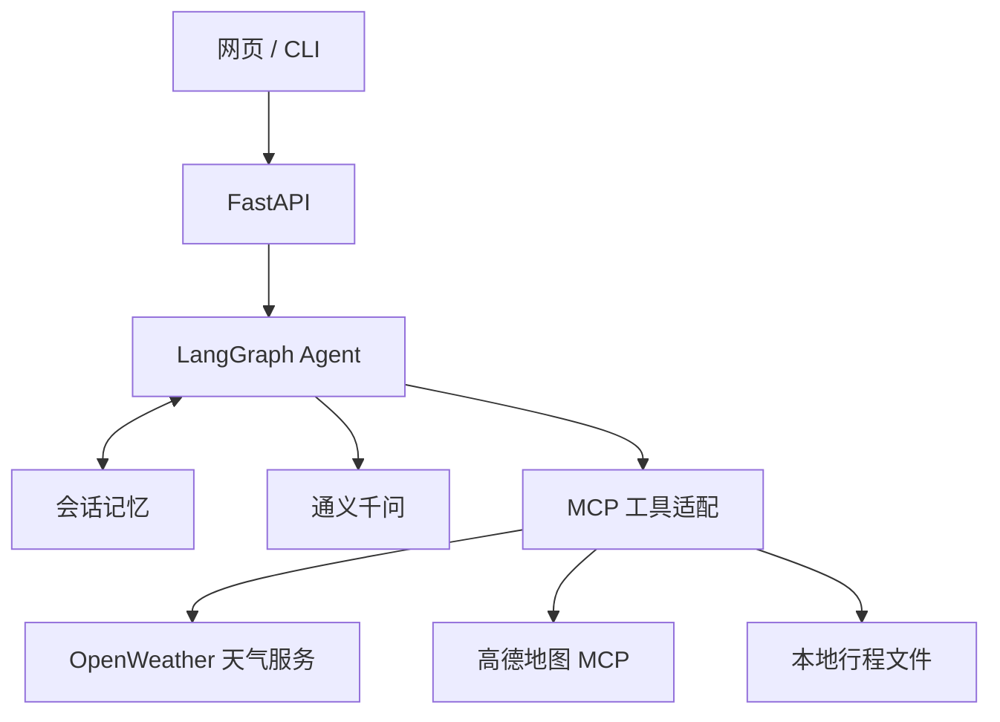

# Travel Assistant · 智能出行助手

基于 **LangGraph、MCP、通义千问和 FastAPI** 的中文智能出行助手，支持天气查询、地点搜索、路线规划、多轮对话和行程保存，提供网页与命令行两种使用方式。

## 项目功能

- **智能对话**：通过 LangGraph 编排模型与工具调用，根据出行需求组织回复。
- **天气查询**：接入 OpenWeather，查询当前天气、温度、湿度和风速。
- **地点与路线**：通过高德地图 MCP 服务进行地点检索、地理编码和路线规划。
- **多轮记忆**：按会话保存上下文，支持继续讨论或开始新会话。
- **行程保存**：将对话中的行程保存为本地 Markdown 或文本文件。
- **网页交互**：中文响应式界面，支持快捷提问和工具调用状态展示。
- **命令行交互**：通过 CLI 进行对话、新建会话和保存行程。

## 技术栈

Python 3.11 / 3.12、LangGraph、LangChain MCP Adapters、MCP Python SDK、通义千问、FastAPI、HTTPX、HTML / CSS / JavaScript。



## 安装与启动

```bash
git clone https://github.com/xiongzihao22/Travel-Assistant.git
cd Travel-Assistant
python -m venv .venv
```

**Windows PowerShell：**

```powershell
.venv\Scripts\Activate.ps1
Copy-Item .env.example .env
```

**macOS / Linux：**

```bash
source .venv/bin/activate
cp .env.example .env
```

**安装依赖并启动：**

```bash
python -m pip install -r requirements.txt -c constraints.txt
python -m uvicorn api_server:app --host 127.0.0.1 --port 8000
```

网页入口：**http://127.0.0.1:8000**  
API 文档：**http://127.0.0.1:8000/docs**

## 模式与配置

### 演示模式

默认配置 `APP_MODE=demo`，无需 API 密钥。使用本地规则和固定北京样例体验天气、行程、会话记忆和文件保存流程。

示例提问：

- `查询北京当前天气`
- `帮我规划北京一日行程`
- 勾选“允许本次保存文件”后输入 `保存上一条结果`

### 真实模式

在 `.env` 中填写：

```dotenv
APP_MODE=live
DASHSCOPE_API_KEY=你的百炼密钥
MODEL=qwen-plus
MODEL_BASE_URL=https://dashscope.aliyuncs.com/compatible-mode/v1
OPENWEATHER_API_KEY=你的OpenWeather密钥
AMAP_API_KEY=你的高德Web服务密钥
```

保存后重启服务。通义千问通过百炼 OpenAI 兼容接口调用；`MODEL_BASE_URL` 应与密钥地域一致。

高德默认使用 Streamable HTTP：

```dotenv
AMAP_TRANSPORT=streamable_http
AMAP_MCP_URL=https://mcp.amap.com/mcp
```

也可将 `AMAP_TRANSPORT` 改为 `sse`，并填写对应高德 SSE 服务地址。密钥由 `AMAP_API_KEY` 自动注入。

示例提问：`查询杭州当前天气，并规划杭州东站到西湖的驾车路线。`

### 其他配置

| 变量 | 默认值 | 说明 |
| --- | --- | --- |
| `OUTPUT_DIR` | `output` | 行程文件保存目录 |
| `REQUEST_TIMEOUT` | `90` | 单次请求超时秒数 |
| `MAX_SESSIONS` | `100` | 会话数量上限 |
| `MAX_TURNS` | `30` | 单个会话轮数上限 |
| `APP_API_TOKEN` | 空 | 可选服务访问令牌 |

设置 `APP_API_TOKEN` 后，网页会提示输入令牌，CLI 从 `.env` 读取。项目默认作为单用户本地服务运行。会话保存在内存中，服务重启后清空；行程文件保留在输出目录中。

## CLI 使用

保持 API 服务运行，在另一个终端激活环境后执行：

```bash
python client.py
```

- `/new`：开始新会话。
- `/save`：保存上一条回复到文件。
- `/quit`：退出。

## API 使用

| 接口 | 用途 |
| --- | --- |
| `GET /health` | 查看运行模式、可用工具与服务状态 |
| `POST /sessions` | 创建会话，获取 `thread_id` |
| `POST /chat` | 提交消息，返回回复与工具调用状态 |
| `DELETE /sessions/{thread_id}` | 删除会话记忆 |

先调用 `POST /sessions`，再使用返回的 UUID 发送消息：

```http
POST /chat
Content-Type: application/json

{"thread_id":"替换为返回的UUID","message":"查询北京天气","allow_save":false}
```

`allow_save=true` 表示允许本次请求创建行程文件。配置了访问令牌时，请附带 `Authorization: Bearer <token>`。

## 项目结构

```text
api_server.py              FastAPI 接口与会话管理
client.py                  CLI 客户端
weather_server.py          天气 MCP 服务
write_server.py            行程保存 MCP 服务
demo_maps_server.py        演示地图 MCP 服务
servers_config.json        MCP 服务配置
agent_prompts.txt          Agent 提示词
requirements.txt           项目依赖
constraints.txt            依赖版本约束
travel_assistant/
  agent.py                 Agent 状态图与工具调用
  config.py                环境变量配置
  demo.py                  演示模式规则模型
  weather.py               天气查询
  files.py                 行程文件保存
web/
  index.html               网页入口
  style.css                界面样式
  app.js                   对话交互
```
