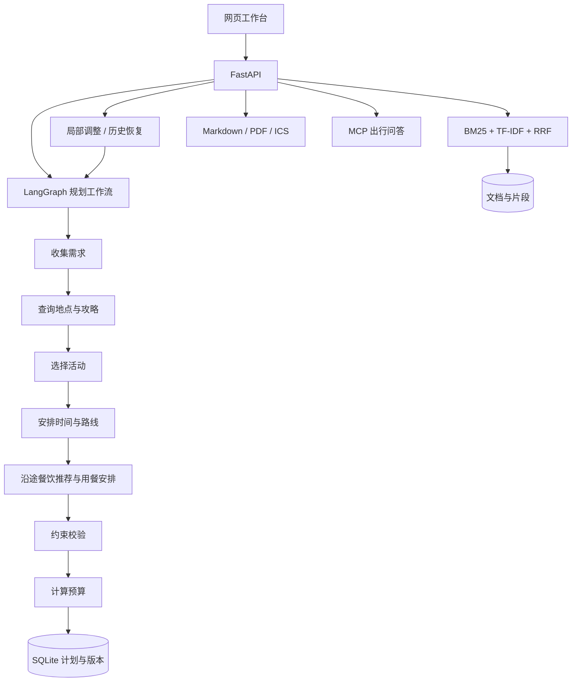

# Travel Assistant · 智能出行助手

基于 **LangGraph、MCP、通义千问和 FastAPI** 的旅行规划工作台。输入目的地、日期、同行人数、预算和饮食偏好，生成包含景点与午晚餐的每日行程，在地图上查看游览顺序，并通过自然语言调整安排。计划、历史版本和旅行资料保存在 SQLite 中。

## 项目功能

| 功能 | 使用方式 |
| --- | --- |
| 个性化规划 | 根据兴趣、节奏、交通方式和同行人生成 1–7 天行程，缺少目的地或日期时继续追问 |
| 每日行程与地图 | 查看活动时间、地点、费用和游览顺序，在地图上切换每天的路线与住宿位置 |
| 沿途餐饮推荐 | 结合菜系、饮食偏好、每餐人均预算与绕行距离安排午晚餐，提供主选和备选餐厅 |
| 换餐与路线联动 | 一键选用备选餐厅，或提出“第二天午餐换成本地菜，人均不超过 60 元”，更新当天时间、路线和餐费 |
| 自然语言调整 | 提出“第二天下雨，换成室内活动”“减少景点，不要太累”等修改需求，局部更新安排 |
| 预算管理 | 统计门票、餐饮、住宿、当地交通和预备金，展示总额、人均费用、预算差额与节省建议 |
| 攻略知识库 | 导入 TXT、Markdown 或 PDF，检索资料并展示回答引用的原文片段 |
| 历史版本 | 保存多个旅行计划，查看修改记录，将历史版本恢复为新版本 |
| 行程导出 | 下载 Markdown、中文 PDF 和可导入日历的 ICS 文件 |
| 出行问答 | 通过 MCP 查询天气、地点及交通路线，保留网页和 CLI 对话入口 |

## 技术架构

- **LangGraph**：编排需求收集、信息检索、地点选择、时间安排、约束校验和预算计算。
- **餐饮推荐**：检索高德周边餐饮地点，结合预算、菜系、饮食偏好与绕行距离排序，将选中的餐厅纳入每日时间线。
- **通义千问**：通过 OpenAI 兼容接口提取结构化需求，结合候选地点与检索资料生成计划。
- **MCP**：连接本地天气、文件工具与高德地图服务。
- **FastAPI + Pydantic**：提供异步接口、结构化数据校验及访问令牌配置。
- **SQLite**：持久化旅行计划、不可变历史版本、文档和检索片段；通过版本号检测并发修改。
- **混合检索**：BM25 与字符 TF-IDF 余弦相似度融合，使用 RRF 排序，保留资料来源。
- **Leaflet**：展示 WGS84 地点标记与每日路径，地图采用 OpenStreetMap 底图。
- **ReportLab**：生成包含每日安排、预算和引用资料的中文 PDF。



## 安装与运行

需要 **Python 3.11 或 3.12**。

```bash
git clone https://github.com/xiongzihao22/Travel-Assistant.git
cd Travel-Assistant
python -m venv .venv
```

Windows PowerShell：

```powershell
.venv\Scripts\Activate.ps1
Copy-Item .env.example .env
```

macOS / Linux：

```bash
source .venv/bin/activate
cp .env.example .env
```

安装依赖并启动：

```bash
python -m pip install -r requirements.txt -c constraints.txt
python -m uvicorn api_server:app --host 127.0.0.1 --port 8000
```

- 网页：**http://127.0.0.1:8000**
- API 文档：**http://127.0.0.1:8000/docs**
- CLI：在另一个终端激活虚拟环境，运行 `python client.py`。

## 使用流程

1. 新建行程，填写目的地、出发日期、天数、人数、总预算、兴趣、菜系和每餐人均预算。
2. 生成后切换每日安排，查看景点与午晚餐时间线、地图标记、费用明细及引用资料。
3. 展开餐厅备选并一键换餐，或输入“第二天午餐换成本地菜，人均不超过 60 元”等需求，保存后查看新版本。
4. 在资料库导入自己的攻略，再针对内容提问。
5. 查看历史记录，按需恢复版本，或导出 PDF、Markdown、日历文件。

示例需求：`两个人去杭州玩三天，预算 3000 元，喜欢自然风光，不想太累。`

预算金额以 **人民币、所有同行人合计** 计算，住宿按天数减一估算。费用明细用于行程预算；地点连线和交通耗时估算会在地图旁标明数据类型。地图底图需要网络连接。

餐饮预算汇总每日早餐预算及已选午晚餐的人均费用，并乘以同行人数；备选餐厅不计入费用和路线。餐厅卡片展示菜系、地址、推荐理由、价格来源，以及可用的评分和营业时间。PDF 和 Markdown 包含用餐及备选信息，日历仅导出已选餐厅的用餐事件。

## 模式与配置

### 演示模式

默认 `APP_MODE=demo`，无需 API 密钥。支持北京、杭州、上海、成都的内置地点资料与餐饮样例，使用本地规则生成行程、推荐用餐、调整计划和检索资料。计划保存、版本管理、资料导入和导出均可直接使用。

### 真实模式

在 `.env` 中配置：

```dotenv
APP_MODE=live
DASHSCOPE_API_KEY=你的百炼密钥
MODEL=qwen-plus
MODEL_BASE_URL=https://dashscope.aliyuncs.com/compatible-mode/v1
AMAP_API_KEY=你的高德Web服务密钥
OPENWEATHER_API_KEY=你的OpenWeather密钥
```

重启后使用模型进行结构化规划与资料问答，通过高德查询地点与路线、OpenWeather 查询天气。`MODEL_BASE_URL` 需与百炼密钥的地域一致。

高德 MCP 默认使用 Streamable HTTP：

```dotenv
AMAP_TRANSPORT=streamable_http
AMAP_MCP_URL=https://mcp.amap.com/mcp
```

也可以配置 `AMAP_TRANSPORT=sse` 和对应的 SSE 服务地址。

### 运行参数

| 变量 | 默认值 | 用途 |
| --- | --- | --- |
| `DATABASE_PATH` | `data/travel.db` | SQLite 数据库路径 |
| `OUTPUT_DIR` | `output` | MCP 文件保存目录 |
| `REQUEST_TIMEOUT` | `90` | 请求超时秒数 |
| `MAX_SESSIONS` | `100` | 问答会话数量上限 |
| `MAX_TURNS` | `30` | 单个问答会话轮数上限 |
| `APP_API_TOKEN` | 空 | 可选访问令牌；网页输入、CLI 从环境读取 |

服务重启后旅行计划、历史版本和知识库继续保留。普通出行问答的会话上下文保存在内存中。

## API

| 接口 | 功能 |
| --- | --- |
| `GET /health` | 服务状态、模式与 MCP 工具 |
| `GET /trips` | 旅行计划列表 |
| `POST /trips` | 生成计划或返回待补充信息 |
| `GET /trips/{id}` | 获取计划 |
| `POST /trips/{id}/revise` | 自然语言调整，提交 `base_version` |
| `POST /trips/{id}/meals/select` | 选用餐厅备选，提交 `day`、`slot`、`restaurant_id` 和 `base_version` |
| `GET /trips/{id}/versions` | 版本历史 |
| `POST /trips/{id}/restore` | 恢复指定版本，提交 `version` 和 `base_version` |
| `DELETE /trips/{id}` | 删除计划 |
| `GET /trips/{id}/export?format=pdf` | 导出 `pdf` / `md` / `ics` |
| `GET /knowledge/documents` | 资料列表 |
| `POST /knowledge/documents` | 导入文本资料 |
| `POST /knowledge/upload` | 上传 TXT、MD 或 PDF |
| `DELETE /knowledge/documents/{id}` | 删除资料及其索引 |
| `POST /knowledge/ask` | 基于资料的问答与引用 |
| `POST /sessions` | 新建问答会话 |
| `POST /chat` | 普通出行问答 |
| `DELETE /sessions/{id}` | 删除问答会话 |

创建计划的请求示例：

```json
{
  "message": "喜欢自然风景，安排轻松一些",
  "preferences": {
    "destination": "杭州",
    "start_date": "2026-11-01",
    "days": 3,
    "travelers": 2,
    "budget": 3000,
    "interests": ["自然", "人文"],
    "pace": "relaxed",
    "transport": "transit",
    "companion": "朋友",
    "cuisine_preferences": ["本地菜"],
    "dietary_preferences": ["不吃辣"],
    "meal_budget_per_person": 60
  }
}
```

修改请求示例：

```json
{"message": "第二天下雨，换成室内活动", "day": 2, "base_version": 1}
```

餐饮修改示例：

```json
{"message": "第二天午餐换成本地菜，人均不超过60元", "day": 2, "base_version": 1}
```

版本不一致时返回 `409`，刷新当前计划后再提交。配置访问令牌后，API 请求附带 `Authorization: Bearer <token>`。

## 项目结构

```text
api_server.py             服务入口与问答 API
client.py                 命令行问答客户端
weather_server.py         天气 MCP 服务
write_server.py           文件 MCP 服务
demo_maps_server.py       演示地图 MCP 服务
travel_assistant/
  models.py               行程、活动、路线、预算数据模型
  planner.py              LangGraph 规划与局部调整
  meal_planning.py        用餐时间安排与餐厅切换
  dining.py               餐饮检索与候选排序
  destinations.py         内置目的地资料
  storage.py              SQLite 计划与版本管理
  knowledge.py            文档处理、混合检索与资料问答
  exports.py              Markdown、PDF、日历导出
  routes.py               行程与资料 API
  agent.py                MCP 对话 Agent
  config.py               环境变量配置
web/                      工作台页面、样式与交互
data/                     本地数据库与内置资料
```
