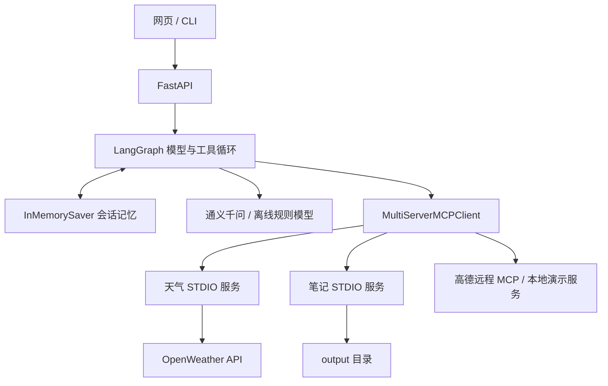

# Travel Assistant · 智能出行助手

基于 **LangGraph + MCP + 通义千问 + FastAPI** 的中文出行助手，提供网页和 CLI 入口，把天气查询、地点搜索、路线规划和行程保存组合到多轮对话中。

> 本仓库是依据[飞书教程的项目架构](https://dqej47nflyz.feishu.cn/wiki/PenqwX3LMiQrVrkaka2c39Vwnvd)独立编写的学习实践版本，**不是教程作者的原始源码，也不是其官方仓库**。没有获得或导入作者完整代码。演示模式的数据及模型决策均为本地固定样例，不代表真实天气、路线或模型效果。


## 功能

| 模块 | 实现 |
| --- | --- |
| Agent | LangGraph `StateGraph` 显式构建模型 → 工具 → 模型循环 |
| 工具接入 | `MultiServerMCPClient` 自动发现本地 STDIO 与远程 MCP 工具 |
| 天气 | OpenWeather 当前天气，含来源、单位、观测时间；不冒充未来预报 |
| 地图 | 高德官方 MCP，默认 Streamable HTTP；仅启用查询及路线工具 |
| 多轮对话 | `InMemorySaver` + 服务端生成的 UUID 会话；重启清空 |
| 行程保存 | 显式授权本次保存，仅新建 `output/` 中的 `.md/.txt` 文件 |
| 界面 | 无需 Node 构建的响应式中文网页，显示模式、工具调用状态和错误 |
| API / CLI | FastAPI 异步接口、OpenAPI 文档、命令行对话 |
| 验证 | 无密钥离线演示、真实 STDIO MCP 集成测试、API 与文件边界测试 |

## 快速开始（无需密钥）

需要 Python **3.11 或 3.12**。在本机终端运行：

```bash
git clone https://github.com/xiongzihao22/Travel-Assistant.git
cd Travel-Assistant
python -m venv .venv
```

Windows PowerShell：

```powershell
.venv\Scripts\Activate.ps1
Copy-Item .env.example .env
```

macOS / Linux：

```bash
source .venv/bin/activate
cp .env.example .env
```

安装并启动：

```bash
python -m pip install -r requirements.txt -c constraints.txt
python -m uvicorn api_server:app --host 127.0.0.1 --port 8000
```

打开 **http://127.0.0.1:8000**，接口文档在 **http://127.0.0.1:8000/docs**。

默认 `APP_MODE=demo`，可以依次输入：

1. `查询北京当前天气`
2. `帮我规划北京一日行程`
3. 勾选“允许本次保存文件”，输入 `保存上一条结果`

演示模式使用**固定北京样例和规则路由器**，不进行通义千问、OpenWeather 或高德网络调用。它仍使用真实 LangGraph 状态图、MCP STDIO 子进程和文件写入，不是静态聊天截图。输入其他城市也不能获得对应真实结果；界面和输出会标注演示状态。

## 切换真实服务

编辑本机 `.env`（不要提交）：

```dotenv
APP_MODE=live
DASHSCOPE_API_KEY=你的百炼密钥
MODEL=qwen-plus
MODEL_BASE_URL=https://dashscope.aliyuncs.com/compatible-mode/v1
OPENWEATHER_API_KEY=你的OpenWeather密钥
AMAP_API_KEY=你的高德Web服务密钥
```

重启后生效。百炼使用 **OpenAI 兼容接口**接入 `ChatOpenAI`，模型仍为通义千问。密钥与接口地域应一致，可通过 `MODEL_BASE_URL` 更换地域端点。缺少模型密钥时启动失败，不会静默切回演示；缺少地图或天气密钥时显示不可用提示。

- 高德按[当前官方接入说明](https://lbs.amap.com/api/mcp-server/gettingstarted)默认使用 `https://mcp.amap.com/mcp` 和 `streamable_http`，密钥在运行时从环境注入。旧服务可设置 `AMAP_TRANSPORT=sse` 和对应高德 SSE 地址。URL 配置不能包含密钥或查询参数。
- 天气采用 [OpenWeather Current Weather API](https://openweathermap.org/api/current)。中文城市若解析失败，可尝试 `Beijing,CN` 等英文名称；该工具不提供未来预报。
- 高德工具发现失败会降级为其他可用工具，并在网页显示警告；修正密钥后重启重连。
- 服务费用及配额由各 API 提供方决定。此仓库不附带密钥。

真实模式示例：`查询杭州当前天气，并规划杭州东站到西湖的驾车路线。` 模型根据已加载工具选择调用，必要时先查询地名坐标。实际表现取决于模型及外部服务。

## CLI 与 API

保持服务运行，在另一个终端激活环境后：

```bash
python client.py
```

`/new` 新会话，`/save` 授权保存上一条结果，`/quit` 退出。

API 先 `POST /sessions` 获取 `thread_id`，再调用：

```http
POST /chat
Content-Type: application/json

{"thread_id":"替换为服务端返回的UUID","message":"查询北京天气","allow_save":false}
```

| 接口 | 用途 |
| --- | --- |
| `GET /health` | 模式、已加载工具和降级警告 |
| `POST /sessions` | 新建会话 |
| `POST /chat` | 提交一轮消息；返回答案和工具调用状态 |
| `DELETE /sessions/{thread_id}` | 清除对话记忆，不删除已保存的文件 |

如设置 `APP_API_TOKEN`，以上接口均需 `Authorization: Bearer <token>`。网页会提示输入令牌，仅存于页面内存；CLI 从本地 `.env` 读取。当前是**单用户本地应用**：可选令牌是共享访问凭据，并非多用户账号系统，会话 UUID 不能替代用户权限隔离。不要将其作为公共多租户服务部署。

## 架构与目录



```text
api_server.py              HTTP API、会话并发与生命周期
client.py                  CLI 客户端
weather_server.py          天气 MCP 入口
write_server.py            文件保存 MCP 入口
demo_maps_server.py        明确标注的固定地图样例
servers_config.json        工具服务声明（不是通用 MCP 客户端配置）
agent_prompts.txt          系统提示词
travel_assistant/
  agent.py                 MCP 加载、工具授权、状态图
  config.py                环境变量与设置
  demo.py                  无密钥规则模型
  weather.py               天气查询与错误处理
  files.py                 受限目录写入
web/                       HTML / CSS / JavaScript
tests/                     单元及 MCP 集成测试
```

本地工具每次调用使用独立 MCP 会话，由适配器上下文关闭；没有调用教程片段中未经确认的 `cleanup()` 方法。API 生命周期负责初始化 Agent 并在关闭时释放引用和内存状态。

## 测试

```bash
python -m pip install -r requirements-dev.txt -c constraints.txt
python -m ruff check .
python -m pytest -q
```

`constraints.txt` 固定本次验证使用的依赖版本。CI 覆盖 Windows / Linux、Python 3.11 / 3.12。集成测试会真实启动三个本地 MCP 子进程，验证工具发现、对话隔离、记忆清除和保存授权；测试不需要外部 API 密钥。

**验证边界：** 离线测试不等同于真实模型质量评测。未配置个人密钥之前，无法验证通义千问、高德与 OpenWeather 的真实账号连通性、额度和返回质量。未进行吞吐量压测，未声称准确率或并发性能指标。

## 已知限制

- 非流式回答，等待完整结果；工具过程仅显示名称与调用状态，不展示模型隐藏推理。
- 会话记忆在进程内；每会话默认最多 30 轮、最多 100 个会话。多进程部署需另行引入共享存储和并发控制。浏览器刷新会遗忘当前会话 ID，服务端旧会话占用配额直到删除或重启。
- 同一会话只允许一个进行中的请求；请求超时或图执行失败会销毁该会话以避免残缺工具消息污染后续对话。已经保存的文件不会因后续超时回滚。
- 文件保存必须逐次勾选授权，限制普通 `.md/.txt` 名称、100 KB 和新建模式；模型内容以纯文本渲染。
- 默认只监听本机，文件目录不可从网页直接下载；需要时在本机 `output/` 查看。
- 未实现 RAG、Milvus、酒店预订、支付或真实导航界面。这些不属于当前实现范围。
- 为贴近教程保留 `langchain-mcp-adapters==0.2.2`，该上游仓库现已归档，后续升级可迁移至 `langchain.mcp`；请先运行集成测试再调整依赖。

## 来源

- [教程架构说明](https://dqej47nflyz.feishu.cn/wiki/PenqwX3LMiQrVrkaka2c39Vwnvd)：用于确定功能与模块划分；未复制完整教程或图片。
- [LangGraph](https://docs.langchain.com/oss/python/langgraph/overview)、[MCP SDK](https://github.com/modelcontextprotocol/python-sdk)、[LangChain MCP Adapters](https://github.com/langchain-ai/langchain-mcp-adapters)：依赖及官方接口参考。
- [百炼 OpenAI 兼容接口](https://help.aliyun.com/zh/model-studio/compatibility-of-openai-with-dashscope)、[高德 MCP](https://lbs.amap.com/api/mcp-server/gettingstarted)、[OpenWeather](https://openweathermap.org/api/current)：真实服务配置参考。

依赖各自保留其上游许可证；本仓库不代表原教程作者提供的实现。
